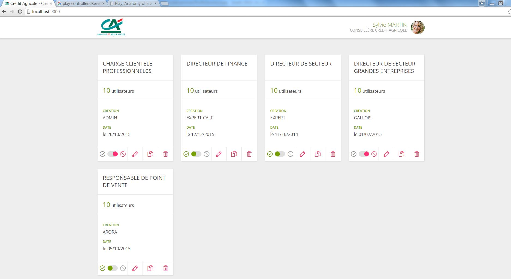

# Play Scala practice project

## Command to be executed on ./client 

## Install npm dependencies:
```
npm install   
```

## Build stylus:
```
npm run build-stylus
```

## Watch stylus:
```
npm run watch-stylus
```

## Build js:
```
npm run build-js
```

## Watch js:
```
npm run watch-js
```
## Command to be executed on ./server

## Compile:
```
activator compile
```

## Run:
```
activator run 
```
Play server runs application by default at : http://localhost:9000


## Output


